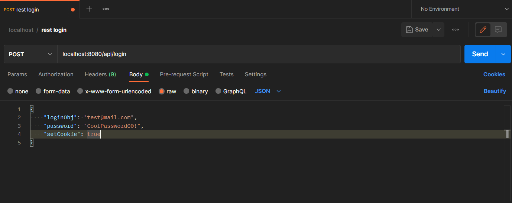
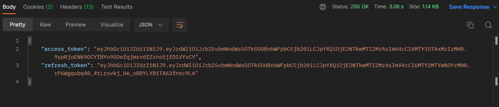
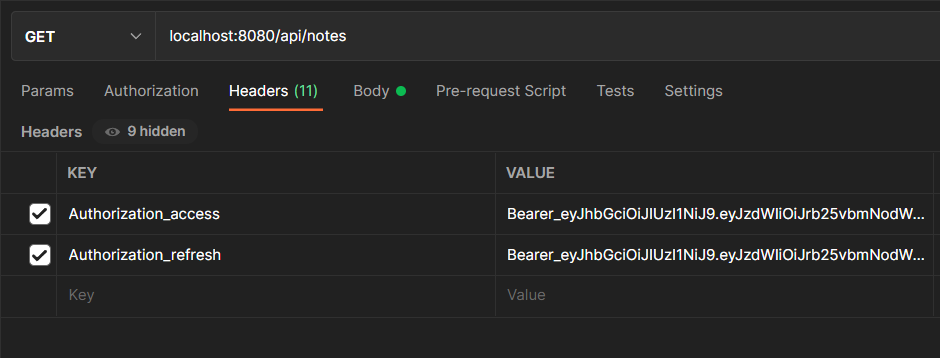
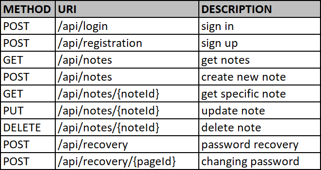

<div align="center">
  <h3 align="center">TO DO LIST</h3>

  <p align="center">
    Pet-project
    <br />
    ·
    <a href="https://github.com/kqlqk/list_TODO/issues">Report Bug</a>
    ·
    <a href="https://github.com/kqlqk/list_TODO/issues">Request Feature</a>
  </p>
</div>

## About The Project
TODO List is a simple way to write down all your plans, tasks, ideas in one place.


## Technologies Used
<details>
  <summary>Back-end</summary>
  <ol>
    <li><p>Java 11</p></li>
    <li><p>Maven</p></li>
    <li><p>Spring</p>
      <ul>
        <li><p>Spring boot</p></li>
            <details>
                <summary>Starters:</summary>
                <ol>
                    <ul>
                    <li><p>Data jpa</p></li>
                        <ul><li><p>Hibernate</p></li></ul>
                    <li><p>Mail</p></li>
                    <li><p>OAuth2 client</p></li>
                    <li><p>Security</p></li>
                    <li><p>Test</p></li>
                        <ul>
                            <li><p>JUnit</p></li>
                            <li><p>Mockito</p></li>
                        </ul>
                    <li><p>Validation</p></li>
                    <li><p>Web mvc</p></li>
                        <ul><li><p>Tomcat</p></li></ul>
                    <li><p>Thymeleaf</p></li>
                    </ul>
                </ol>
            </details>
      </ul>
    </li>
    <li><p>Jackson</p></li>
    <li><p>JsonWebToken</p></li>
    <li><p>PostgreSQL</p></li>
  </ol>
</details>

<details>
  <summary>Front-end</summary>
  <ol>
    <li><p>CSS</p></li>
    <ul>
        <li><p>Bootstrap</p></li>
    </ul>
    <li><p>HTML</p></li>
    <li><p>JavaScript</p></li>
  </ol>
</details>


## Get Started
* project is on developing
* You can use your frontend with <a href="#rest api">rest api</a>
* was hidden application.properties in src/main/resources/


## AUTH
Authentication and authorization works with JWT.

Below is a small example of authentication using postman

1. We should send POST request to {domain}/api/login:



`loginObj` is your email/login

`password` is your password

`setCookie` is an optional value (by default `true`), that can set cookie with access and refresh tokens.


2. After request, we will get response with json that has next values:



`access_token` is your access token

`refresh_token` is your refresh  token

and if in request `setCookie = true` we also will get 2 cookie files with access and refresh tokens.

3.1 If `setCookie = true` log in passed successfully. Now we can go to <a href="##REST API">REST API</a> 

3.2 But if `setCookie = false` we should add custom header with tokens to subsequent requests:



Keys:
* `Authorization_access` for access token 
* `Authorization_refresh` for refresh token


<li><p>Values:</p>
      <ul>
        <li><p> consist of `prefix` and `token`</p></li>
        <li><p> has form: prefix_token </p></li>
      </ul>

* `prefix` is `Bearer_`
* `token` for `Authorization_access` is `access_token` for `Authorization_refresh` is `refresh_token` that we got in response on the step 2

Log in passed successfully. Now we can go to <a href="##REST API">REST API</a>


##REST API
Below you can find all available requests and descriptions for them.



`{noteId}` is an id of your note

`{pageId}` is an id of the page that you will get if you try to recover your password 
<details>
  <summary><code>POST /api/login</code></summary>
  <ol>
    <li><p>Request JSON:
<code>

    {
    "loginObj": "test@mail.com",
    "password": "CoolPassword00!",
    "setCookie": true
    }
</code>
<code>setCookie</code> is an optional value (by default <code>true</code>), that can set cookie with access and refresh tokens.</p></li>
<li><p>Response JSON 
<code>

    {
    "access_token":"someBigAccessToken"
    "refresh_token":"someBigRefreshToken"
    }
</code></p></li></ol>
</details>

<details>
<summary><code>POST /api/registration</code></summary>
  <ol>
    <li><p>Request JSON:
<code>

    {
    "email": "test@mail.com",
    "login":"CoolName123",
    "password": "CoolPassword00!",
    "setCookie": true
    }
</code>
<code>setCookie</code> is an optional value (by default <code>true</code>), that can set cookie with access and refresh tokens.</p></li>
<li><p>Response JSON 
<code>

    {
    "access_token":"someBigAccessToken"
    "refresh_token":"someBigRefreshToken"
    }
</code></p></li></ol>
</details>

<details>
<summary><code>POST /api/notes</code></summary>
  <ol>
    <li><p>Request JSON:
<code>

    {
    "title": "my plan",
    "body": "buy watermelon"
    }
</code>
<code>body</code> is an optional value, that can set body to your note.</p></li>
<li><p>Response JSON 
<code>

    [{
        "id": 87,
        "title": "my plan 2",
        "body": "buy banans",
        "lastEdited": "2022-07-25T09:41:21.536+00:00",
        "userId": 3
    },
    {
        "id": 123,
        "title": "my plan",
        "body": "buy watermelon",
        "lastEdited": "2022-07-28T15:38:12.989+00:00",
        "userId": 3
    }]
</code></p></li></ol>
</details>

<details>
<summary><code>GET /api/notes</code></summary>
  <ol><li><p>Response JSON 
<code>

    [{
        "id": 87,
        "title": "my plan 2",
        "body": "buy banans",
        "lastEdited": "2022-07-25T09:41:21.536+00:00",
        "userId": 3
    },
    {
        "id": 123,
        "title": "my plan",
        "body": "buy watermelon",
        "lastEdited": "2022-07-28T15:38:12.989+00:00",
        "userId": 3
    }]
</code></p></li></ol>
</details>


<details>
<summary><code>GET /api/notes/{noteId}</code></summary>
 <ol><li><p>Response JSON 
<code>

    {
        "id": 87,
        "title": "my plan 2",
        "body": "buy banans",
        "lastEdited": "2022-07-25T09:41:21.536+00:00",
        "userId": 3
    }
</code></p></li></ol>
</details>

<details>
<summary><code>PUT /api/notes/{noteId}</code></summary>
  <ol>
    <li><p>Request JSON:
<code>

    {
    "title": "my plan",
    "body": "buy watermelon"
    }
</code>
<code>body</code> is an optional value, that can set body to your note.</p></li>
<li><p>Response JSON 
<code>

    {
    "id": 87,
    "title": "my plan",
    "body": "buy watermelon",
    "lastEdited": "2022-07-28T15:55:00.914+00:00",
    "userId": 7
}
</code></p></li></ol>
</details>

<details>
<summary><code>DELETE /api/notes/{noteId}</code></summary>
  <ol><li><p>Response JSON 
<code>

    [{
    "id": 87,
    "title": "my plan 2",
    "body": "buy banans",
    "lastEdited": "2022-07-25T09:41:21.536+00:00",
    "userId": 3
    },
    {
    "id": 123,
    "title": "my plan",
    "body": "buy watermelon",
    "lastEdited": "2022-07-28T15:38:12.989+00:00",
    "userId": 3
    }]
}
</code></p></li></ol>
</details>

<details>
<summary><code>POST /api/recovery</code></summary>
  <ol>
    <li><p>Request JSON:
<code>

    {
    "email":"test@mail.com"
    }
</code></p></li>
<li><p>Response JSON 
<code>

    {
    "info": "A message with further actions has been sent to your email."
    }
</code></p></li></ol>
</details>

<details>
<summary><code>POST /api/recovery/{pageId}</code></summary>
  <ol>
    <li><p>Request JSON:
<code>

    {
    "password":"TESTpassword123!!"
    }
</code></p></li>
<li><p>Response JSON 
<code>

    {
    "info": "Password was successfully changed."
    }
</code></p></li></ol>
</details>


## CONFIGURATION
You should create `application.properties` in `src/main/resources/`, that consist of
```
spring.datasource.url=yourValue
spring.datasource.driver-class-name=org.postgresql.Driver
spring.datasource.username=yourValue
spring.datasource.password=yourValue
spring.jpa.properties.hibernate.dialect=org.hibernate.dialect.PostgreSQL10Dialect
spring.jpa.properties.hibernate.format_sql=true
spring.jpa.hibernate.ddl-auto=update
spring.jpa.properties.hibernate.current_session_context_class=org.springframework.orm.hibernate5.SpringSessionContext

spring.mvc.hiddenmethod.filter.enabled=true
server.error.whitelabel.enabled=false

logging.level.root=info
logging.file.name=src/main/resources/logs/logs.txt
logging.pattern.file=[%p] [%C.%M] [%d{dd MMM yyyy HH:mm:ss.SSS}] [%m]%n

spring.mail.protocol=yourValue
spring.mail.host=yourValue
spring.mail.port=yourValue
spring.mail.properties.mail.smtp.auth=yourValue
spring.mail.properties.mail.smtp.starttls.enable=yourValue
spring.mail.password=yourValue
spring.mail.username=yourValue

spring.security.oauth2.client.registration.google.client-id=yourValue
spring.security.oauth2.client.registration.google.client-secret=yourValue

jwt.access.secret="yourValue"
jwt.access.expired=yourValue
jwt.refresh.secret="yourValue"
jwt.refresh.expired=yourValue
```


## License
Distributed under the MIT License. See `LICENSE.md` for more information.


## Contact
[Telegram](https://t.me/kqlqk)

Mail - kononchuk99999@gmail.com

Project Link - [https://github.com/kqlqk/TODO_list](https://github.com/kqlqk/TODO_list)
